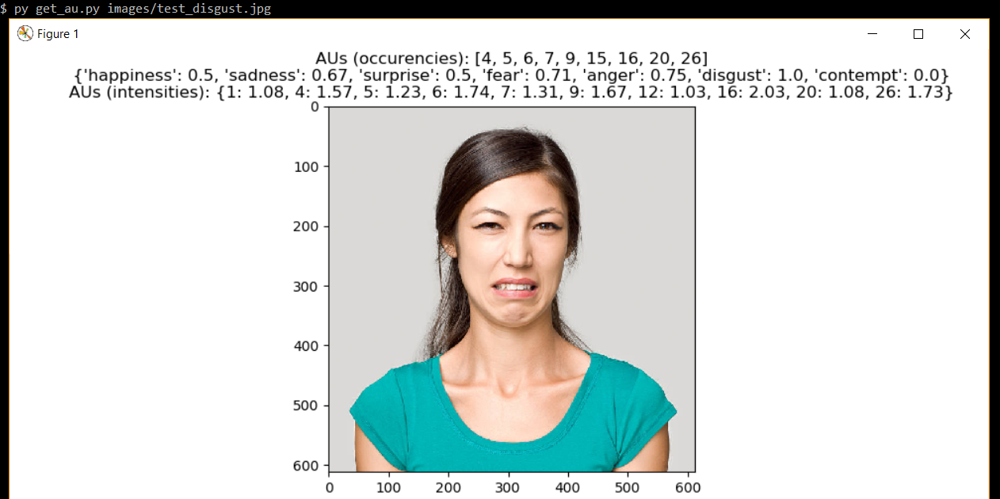

# Python library for Action Unit and Emotion recognition with CNNs, SVMs and SVRs
Project developed for the "Models of Affective Computing" master course.

This repository contains different notebooks/scripts regarding the training of machine learning and deep learning models for facial emotion recognition:
  - The EfficientNet model pre-trained on ImageNet and fine-tuned in different ways to perform single-output multi-class classification and multi-output multi-class/binary classification
  - Support Vector Machines models for Action Units recognition and Support Vector Regression models for Action Units intensity recognition

Moreover, the repository contains the implementation of helper functions to perform Computer Vision pre-processing tasks.

Finally, it includes a script to run one of the trained models on a web app through Streamlit.

### Notebooks:

- face\_helpers: implementation of different functions in order to
  - detect the face of the subject in an image
  - detect the landmarks of the face
  - compute face alignment and masking
  - extract the HOG features

- svm\_training: training of a Support Vector Machines (SVM) binary model for each Action Unit we consider

- svr\_training: training of a Support Vector Regression (SVR) model for each Action Unit we consider

- test\_au\_lib: implementation of tests regarding "au\_lib" script functions

- cnn\_training: training of two models:
  - EfficientNet pre-trained on ImageNet and fine-tuned to perform facial emotion recognition (multi-class classification)
  - EfficientNet pre-trained on ImageNet and fine-tuned to simultaneously detect the emotion and the Action Units from a facial image (multi-output multi-class/binary classification).
More specifically, this model presents 15 output layers: 1 to perform multi-class classification (emotion recognition) and 14 to perform binary classification (one layer for each Action Unit)

### Scripts:

- FaceAligner, helpers: based on [this tutorial](https://www.pyimagesearch.com/2017/05/22/face-alignment-with-opencv-and-python/)
- au_lib: this script implements the following functions
  - get\_img\_aus\_occurencies:      get the Action Units occurencies from an input image (using the trained SVM-based models)
  - get\_img\_aus\_intensities:      get the Action Units intensities from an input image (using the SVR-based models)
  - get\_img\_emotions\_occurencies: given an input image, for each emotion, get the percentage of detected Action Units regarding that emotion (based on AUs occurencies)
- face\_helpers: code extracted starting from the "face\_helpers" notebook
- streamlit\_web\_app: web app that opens the webcam and uses one of the trained image classification models to detect the emotion of the recorded person

- get\_au: given the path of an image, it outputs
  - the Action Units occurencies (SVM-based models)
  - the percentage of Action Units detected for each emotion
  - the detected intensities of the Action Units (SVR-based models)

