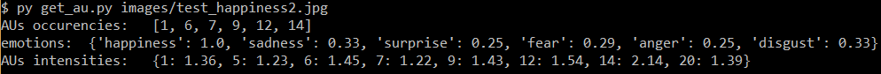
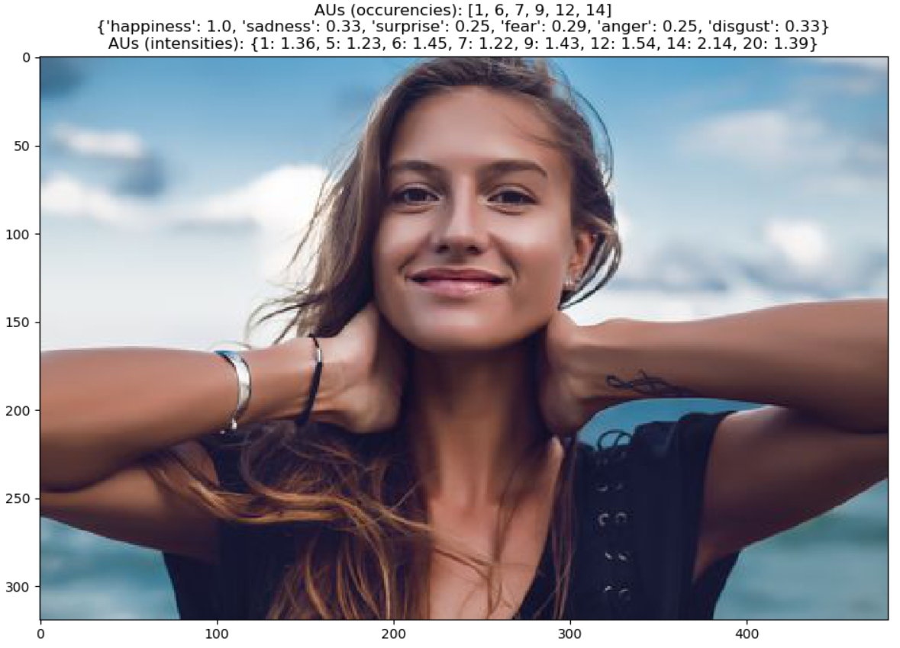

# MCA_Arrotta
### SVMs and SVRs Training for Action Unit detection

Notebooks:

- face\_helpers: implementation of different functions in order to
  - detect the face of the subject in an image
  - detect the landmarks of the face
  - compute face alignment and masking
  - extract the HOG features
- svm\_training: training of a SVM for each Action Unit we consider

- svr\_training: training of a SVR for each Action Unit we consider
- test\_au\_lib: tests about "au\_lib" script functions

 

Scripts:

- FaceAligner, helpers: taken from [this tutorial](https://www.pyimagesearch.com/2017/05/22/face-alignment-with-opencv-and-python/)
- au\_lib: this script implements the following functions
  - get\_img\_aus\_occurencies:      get the AUs occurencies from an image (using the SVMs)
  - get\_img\_aus\_intensities:      get the AUs intensities from an image (using the SVRs)
  - get\_img\_emotions\_occurencies: for each emotion, get the percentage of that emotion AUs detected in an image (based on occurencies)
- face\_helpers: code extracted starting from "face\_helpers" notebook

- get\_au:

